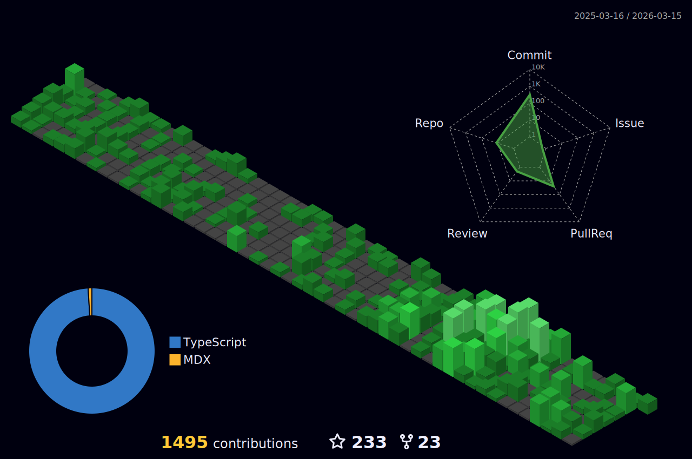

<h1 align="center">Prince Gbalam (Prince Codes)</h1>
<h2 align="center"><b>I’m a software Developer</b></h2>
<ul>
  <li>👀 Full Stack Web3 Developer</li>
  <li>🔭 I write articles on learning tech.</li>
  <li>📖 I’m currently into block chain, with Solidity</li>
  <li>🌱 I’m currently learning Flutter on the side</li>
  <li>🎟 I’m interested in Web3 and Cybersecurity</li>
  <li>💬 Ask me about anything tech related especially on JavaScript</li>
  <li>
    📫 How to reach me: 
    <ol>
      <li>Email: princecodes247@gmail.com</li>
      <li>Facebook: Prince Codes 247</li>
      <li>Twitter: @prince_codes247</li>
      <li>LinkedIn: Prince Codes</li>
    </ol>
  </li>
</ul>

<!--  -->
<!-- 
 -->

<!-- 
 -->
  

## 🧰 Languages and Tools:

  
  
  
  
  
  
  
  
  
  
     
  
    
    
    
    
      
       
  
  
    
      
        
  
    
  
  
  

  

